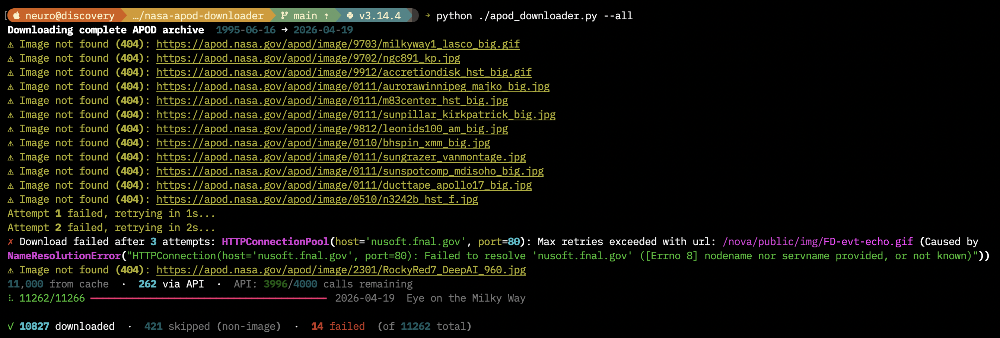

# NASA APOD Image Downloader

A Python script to download images from NASA's Astronomy Picture of the Day (APOD) archive, with a rich terminal UI, local metadata caching, EXIF date stamping, and full archive support.

> [!WARNING]
> This repo contains an experiment to fork an existing, unmaintained open source project with a vertical niche, and use Claude Code to make iterated enhancements to fit and function. This code may not work as expected, so please review it biologically before considering forking or using this code further.

## Features

- Download a single date, a date range, the latest image, random images, or the complete archive
- Concurrent downloads with a live progress bar
- SQLite metadata cache — skips API calls for dates already fetched, making repeat or `--all` runs fast
- `--cache-only` mode to pre-warm the metadata cache without downloading any images
- EXIF date metadata stamped to match the APOD publication date (not the download date)
- File system timestamps (created, modified) set to the APOD publication date
- Non-JPEG/PNG images optionally converted to PNG (`--convert-to-png`)
- Atomic `.part` file staging — interrupted downloads never leave corrupt files
- Live API rate limit display after every fetch
- `--status` flag to check remaining API quota without downloading anything
- `--cache-info` flag to inspect local cache coverage
- API key stored in `~/.config/apod-downloader/config.yaml` (not in the project directory)
- API key redacted from all error output



## Requirements

- Python 3.9+
- Dependencies listed in `requirements.txt`: `requests`, `python-dateutil`, `pyyaml`, `rich`, `Pillow`, `piexif`

## Installation

1. Clone this repository:

   ```bash
   git clone https://github.com/yourusername/apod-downloader.git
   cd apod-downloader
   ```

2. Create and activate a virtual environment (recommended):

   ```bash
   python -m venv .venv
   source .venv/bin/activate   # Windows: .venv\Scripts\activate
   ```

3. Install dependencies:

   ```bash
   pip install -r requirements.txt
   ```

## Configuration

On first run the script creates `~/.config/apod-downloader/config.yaml` with a placeholder API key:

```yaml
api_key: your_api_key_here
```

Replace the placeholder with your [NASA API key](https://api.nasa.gov/). The key can also be supplied via the `NASA_API_KEY` environment variable or the `--api-key` flag — these take precedence over the config file. If no key is configured, the script falls back to `DEMO_KEY` (30 requests/hour).

On Linux and other XDG-compliant systems the config directory respects `$XDG_CONFIG_HOME`. On Windows it uses `%APPDATA%`.

## Usage

### Download the latest image

```bash
python apod_downloader.py
# or explicitly:
python apod_downloader.py --latest
```

### Download a specific date

```bash
python apod_downloader.py --date 2024-04-08
```

### Download a date range

```bash
python apod_downloader.py --start-date 2024-01-01 --end-date 2024-01-31
```

`--end-date` defaults to today when omitted.

### Download the last N days

```bash
python apod_downloader.py --last-days 30
```

### Download a random image (or several)

```bash
python apod_downloader.py --random
python apod_downloader.py --random --count 10
```

### Download the complete archive

```bash
python apod_downloader.py --all
```

Downloads everything from the first APOD (1995-06-16) to today in 100-day batches. Dates already in the local cache skip the API entirely.

### Pre-warm the metadata cache

```bash
python apod_downloader.py --all --cache-only
```

Fetches and caches API metadata for the entire archive without downloading any images or writing JSON sidecar files. Useful before a first `--all` run: the ~11,000 entries fit in around 120 API calls, well within an hour's quota. Any subsequent `--all` will then skip all API calls and go straight to image downloads.

`--cache-only` works with any date selection flag (`--date`, `--start-date`, `--last-days`, `--latest`).

### Check API rate limit

```bash
python apod_downloader.py --status
```

Makes a minimal API call and displays current usage with a colour-coded bar. On a registered key (1,000 requests/hour) the output looks like:

```
NASA API  ·  used: 42/1000  ████░░░░░░░░░░░░░░░░░░░░░░░░░░░░░░░░░░░░  remaining: 958
```

If the quota is exhausted, the remaining wait time is shown instead.

### Inspect the metadata cache

```bash
python apod_downloader.py --cache-info
```

```
Cache  ·  11,384 entries  (1995-06-16 → 2026-04-19)  ·  100.0% of full archive
```

## Output

Images are saved in the output directory (default: `apod_images/`) with filenames in the format:

```
YYYY-MM-DD_Title_Of_The_Image.ext
```

Unless `--no-metadata` is specified, a sidecar JSON file with the same stem is also saved:

```
YYYY-MM-DD_Title_Of_The_Image.json
```

Both the image and JSON file have their file system timestamps (created, modified) set to the APOD publication date.

## All flags

```
positional / mode flags (mutually exclusive):
  --date DATE           Download image for a specific date (YYYY-MM-DD)
  --start-date DATE     Start of a date range (YYYY-MM-DD)
  --latest              Download the latest image
  --random              Download random image(s)
  --all                 Download the complete APOD archive

date range:
  --end-date DATE       End of a date range (defaults to today)
  --last-days N         Download images from the last N days
  --count N             Number of random images (use with --random, default: 1)

output:
  --output-dir DIR      Directory to save images (default: apod_images)
  --no-metadata         Do not save JSON sidecar files
  --convert-to-png      Convert non-JPEG/PNG images (GIF, TIFF, WebP, …) to PNG

cache / status:
  --status              Show NASA API rate limit usage and exit
  --cache-info          Show local metadata cache statistics and exit
  --cache-only          Populate the metadata cache without downloading any images
  --no-cache            Bypass the local cache and always fetch from the API

connection:
  --api-key KEY         NASA API key (overrides config.yaml and NASA_API_KEY env var)
  --max-workers N       Concurrent download threads (default: 5)
  --timeout N           Request timeout in seconds (default: 30)
  --retry-attempts N    Retry attempts on failure (default: 3)
```

## Caching

API responses are cached in `~/.config/apod-downloader/cache.db` (SQLite, WAL mode). Once a date is cached its metadata is never re-fetched, regardless of how many times `--all` is run. Use `--cache-only` to pre-warm the cache without downloading images, `--no-cache` to force a live API call, or `--cache-info` to see current coverage.

## License

This project is licensed under the MIT License. See the [LICENSE](./LICENSE) file for details.
